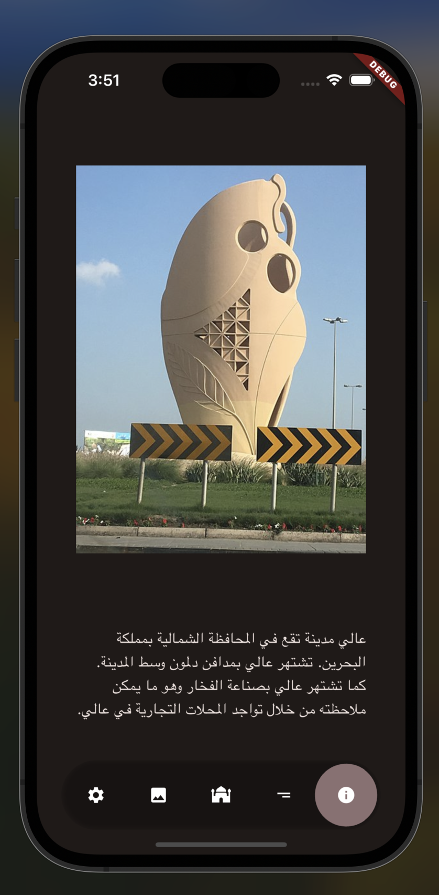
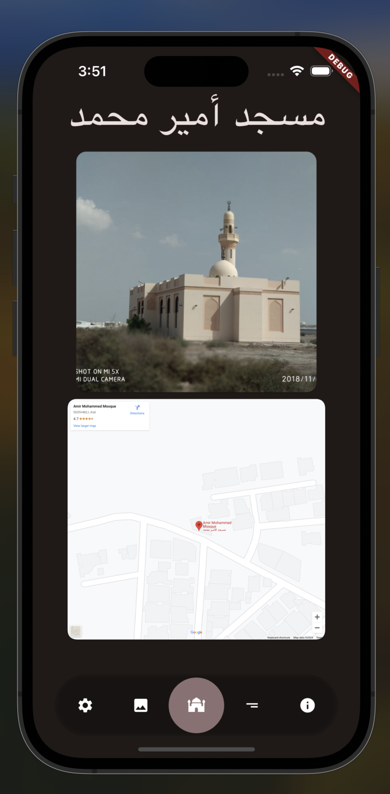
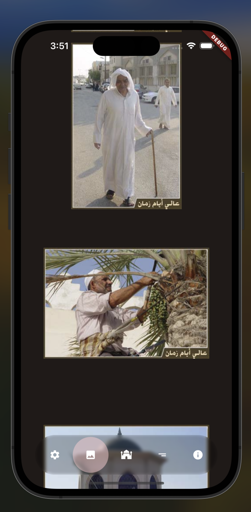

# aali_history

A Flutter project about Aali village and it's great history.

the first screen is a brief description of the village

you also have a list of Mosques in the village with an image and a location in the map

finally there is a screen with a lot of historical images of the village

